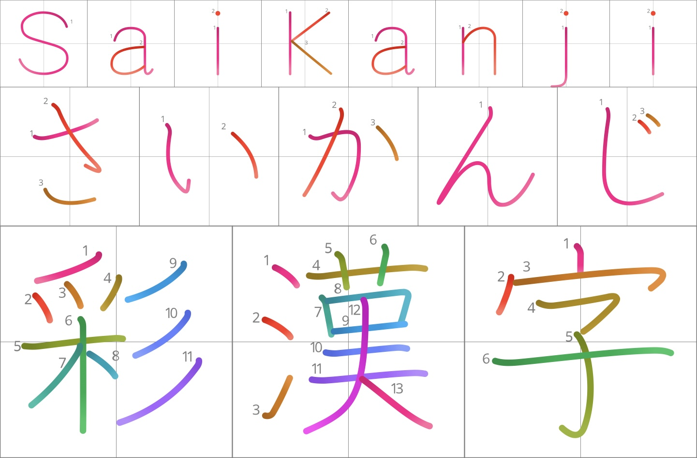

| 🇺🇸 English | 🇯🇵 [日本語](README.ja.md) |
|-|-|

# SaiKanji (彩漢字)

**A beautiful color stroke-order font for learning and displaying kanji.**

SaiKanji transforms the excellent [KanjiVG](https://kanjivg.tagaini.net/) stroke data into a modern, vibrant color font. Each stroke is individually colored with smooth gradients, and stroke order numbers are embedded directly in the font — making it ideal for education, flashcards, apps, and design work.



## Why SaiKanji?

Most kanji fonts are either monochrome or require external tools to show stroke order. SaiKanji brings both **color** and **stroke order** directly into the font itself, so it works consistently across websites, documents, design tools, and Anki — with no extra plugins needed.

## Features

- **Per-stroke coloring** with smooth gradients across regular, light, balanced, contrast, and spectrum styles
- **Built-in stroke order numbers** placed intelligently to avoid overlapping strokes
- **Optional character grids** (outer frame + cross) for better visual reference
- Works as a normal font — no special software required
- Available in both **Gradient** and **Solid** color versions
- Hybrid font technology (COLR + SVG) for broad compatibility
- Derived from the high-quality, open [KanjiVG](https://kanjivg.tagaini.net/) dataset

## Available Variants

SaiKanji comes in many styles so you can choose what works best for your use case:

- **Color styles**: Regular, Regular Light, Balanced, Balanced Light, Contrast, Contrast Light, Spectrum, Spectrum Light
- **Gradient vs Solid** fills
- **With Grid** or **Without Grid**
- **Black** Regular styles for a simple monochrome fallback

This gives you a lot of flexibility depending on whether you're using it for learning, design, or accessibility.

## Preview

Try the live demo at [saikanji.moore.is](https://saikanji.moore.is/).

## Installation

### For Desktop Use

#### Manually
1. Download a `.ttf` file from latest release from the [Releases](https://github.com/am517/SaiKanji/releases) page
2. Install the `.ttf` file on your system

#### Using Homebrew
1. Install the [SaiKanji Tap](https://github.com/am517/homebrew-tap)
```zsh
brew tap am517/tap
brew trust am517/tap
```
2. Install the font
```
brew search font-saikanji
brew install font-saikanji-balanced-gradient-grid
```

### For Web Use
1. Download a `.woff2` file from latest release from the [Releases](https://github.com/am517/SaiKanji/releases) page
Download the `.woff2` version and include it in your project using `@font-face`.
Release filenames use dot-separated style names, for example:

```css
@font-face {
  font-family: "SaiKanji Balanced Gradient Grid";
  src: url("SaiKanji.Balanced.Gradient.Grid.woff2") format("woff2");
}
```

## Development Notes

This project was developed with significant assistance from AI coding models (primarily **Grok 4** and **GPT-5.5**). While the AI generated the majority of the code, all high-level direction, architectural decisions, and final quality review of the output were done by me. 

The focus was always on the quality of the final fonts rather than on producing clean or elegant code. As a result, the code itself has only received cursory review, while the visual and functional quality of the released fonts was evaluated thoroughly.

## For Developers & Advanced Theming

SaiKanji was designed with theming in mind. During development, every stroke and gradient stop references a color slot (originally using CSS custom properties like `--color0`, `--color1`, etc.).

However, in the current release, colors are resolved at build time. This means:

- You cannot currently override individual stroke colors using CSS variables.
- The **COLR versions** of the font support the modern [`font-palette`](https://developer.mozilla.org/en-US/docs/Web/CSS/font-palette) CSS property, which allows swapping or customizing entire color palettes in supporting browsers.

If fine-grained per-stroke color control via CSS becomes important to you, feel free to open an issue. This is something that could potentially be supported in a future version.

For most use cases (Anki, websites, documents, design work), the included color schemes should be sufficient.

## License

SaiKanji is licensed under the [Creative Commons Attribution-ShareAlike 4.0 International License](https://creativecommons.org/licenses/by-sa/4.0/).

See [LICENSE.md](LICENSE.md) for the full license text.

## Attribution

This font is a derivative work based on data from **[KanjiVG](https://kanjivg.tagaini.net/)**  
© 2009–2026 Ulrich Apel, released under CC BY-SA 3.0.

**Preferred attribution:**
> SaiKanji by Adam Moore is derived from KanjiVG by Ulrich Apel (CC BY-SA 3.0) and is licensed under CC BY-SA 4.0.

It was inspired by the [kanji-colorize](https://github.com/cayennes/kanji-colorize) Anki plugin and the [Playwrite](https://github.com/TypeTogether/Playwrite) font family.

## Feedback & Contributions

Found a bug, have a feature idea, or want to suggest a new color scheme?  
Feel free to open an issue on the [issue tracker](https://github.com/am517/SaiKanji/issues) or email me at adam@moore.is.

## Related Projects

- **[KanjiVG](https://kanjivg.tagaini.net/)** — The excellent open dataset of kanji stroke order vector graphics this project is built upon.
- **[kanji-colorize](https://github.com/cayennes/kanji-colorize)** — An Anki plugin that popularized colored stroke order diagrams from KanjiVG data.
- **[Playwrite](https://github.com/TypeTogether/Playwrite)** — A font family inspired by educational handwriting models (creative influence on the overall approach).

## Acknowledgments

Special thanks to Ulrich Apel for creating and maintaining KanjiVG, and to the creators of kanji-colorize and Playwrite for the inspiration.
